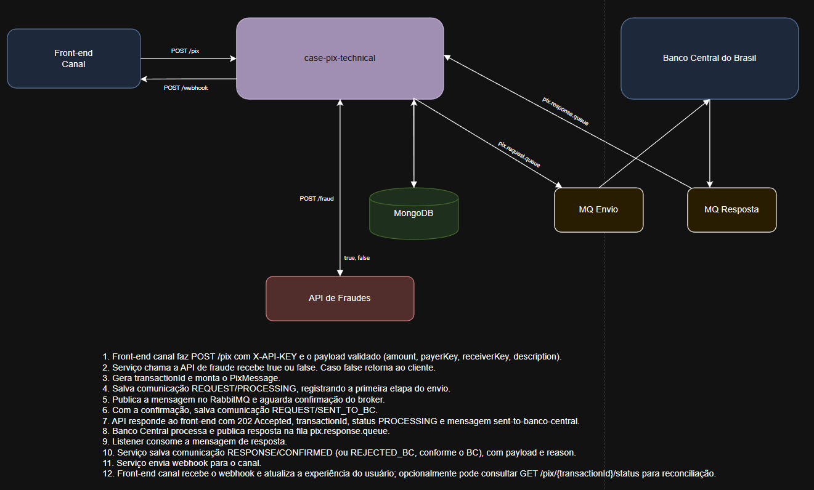

# case-pix-technical
Serviço de integração PIX (Java 21 + Spring Boot) com arquitetura hexagonal.

## Arquitetura (Hexagonal)
- **Domínio**: entidades e eventos do PIX (status, mensagens e comunicações).
- **Aplicação**: casos de uso e portas (entrada/saída).
- **Adapters**:
  - Inbound: HTTP (API REST)
  - Outbound: Fraudes (HTTP), Mensageria (RabbitMQ), Persistência (MongoDB)

Fluxo principal:
1. API recebe o PIX
2. Chamada síncrona para Fraudes
3. Se aprovado, persiste a comunicaçãoo e publica no MQ
4. Resposta do Banco Central chega via fila e é persistida
5. Envia webhook de resposta para o Canal.

## Mensageria
RabbitMQ com exchange direta e DLQ para requests e respostas. Retries configurados via listener (assumindo padrão de 3 tentativas do BC):
- `max-attempts=3`
- backoff exponencial: 1s, 3s, 9s (max 15s)

## Persistência do tráfego com Banco Central
Todas as mensagens enviadas/recebidas são armazenadas em MongoDB.

**Por que MongoDB**:
- Estrutura flexível para payloads variáveis e histórico de mensagens
- Escrita rápida e escala horizontal
- Consultas por transação sem necessidade de joins

## Evoluções

Possíveis evoluções futuras:
- Implementar idempotency key enviada pelo front-end.
- Envio de URL do webhook via parâmetro na requisição em caso de diversos canais.
- Adicionar camada de OAuth/JWT.
- Adicionar tracing (OpenTelemetry) e dashboards para latência e throughput.
- Hardening de segurança: rate limit, mTLS...

## Endpoints
- `POST /pix`
- `GET /pix/{transactionId}/status`
- `GET /pix/{transactionId}/communications`

Documentação:
- Swagger (OpenAPI): `docs/openapi.yaml`
- Postman Collection: `docs/postman_collection.json`

Webhook:
- URL confíguravel via `PIX_WEBHOOK_URL`
- Payload enviado no evento de resposta do Banco Central:
```json
{
  "transactionId": "<uuid>",
  "status": "CONFIRMED",
  "reason": "approved",
  "occurredAt": "2026-02-07T13:00:05Z"
}
```
Observação: falhas no webhook são registradas em log e métrica, sem interromper o consumo da fila.

Exemplo de request:
```json
{
  "amount": 150.75,
  "payerKey": "chave-pagador",
  "receiverKey": "chave-recebedor",
  "description": "Pedido 123"
}
```

Resposta (fraude aprovada):
```json
{
  "transactionId": "<uuid>",
  "status": "PROCESSING",
  "message": "sent-to-banco-central"
}
```

Resposta (fraude reprovada):
```json
{
  "status": "REJECTED_FRAUD",
  "message": "<motivo>"
}
```

Resposta (status):
```json
{
  "transactionId": "<uuid>",
  "status": "SENT_TO_BC",
  "direction": "REQUEST",
  "updatedAt": "2026-02-07T13:00:00Z"
}
```

Resposta (histórico de comunicações):
```json
[
  {
    "direction": "REQUEST",
    "status": "SENT_TO_BC",
    "payload": "{...}",
    "createdAt": "2026-02-07T13:00:00Z"
  },
  {
    "direction": "RESPONSE",
    "status": "CONFIRMED",
    "payload": "{...}",
    "createdAt": "2026-02-07T13:00:05Z"
  }
]
```

## Logs e métricas
- Logs no controller, use cases, publisher, listener e persistência
- Métricas via Actuator/Micrometer
  - `pix.requests`
  - `pix.fraud.rejected`
  - `pix.fraud.failed`
  - `pix.mq.published`
  - `pix.mq.publish.failed`
  - `pix.bc.responses`
  - `pix.bc.responses.failed`

## Configuração

Fraude:
- `pix.fraud.base-url`: `https://case-pix-technical.free.beeceptor.com/fraud`
Webhook:
- `pix.webhook.url` : `https://case-pix-technical.free.beeceptor.com/webhook`

## Subindo o projeto
1. Suba dependências:
```bash
docker compose up -d
```
2. Configure o token da API:
```bash
set PIX_API_KEY=change-me
```
3. Rode a aplicação:
```bash
mvn spring-boot:run
```

Operações principais:
- Criar PIX:
```bash
curl -X POST http://localhost:8080/pix ^
  -H "Content-Type: application/json" ^
  -H "X-API-KEY: change-me" ^
  -d "{\"amount\":150.75,\"payerKey\":\"chave-pagador\",\"receiverKey\":\"chave-recebedor\",\"description\":\"Pedido 123\"}"
```
- Consultar status:
```bash
curl http://localhost:8080/pix/<transactionId>/status -H "X-API-KEY: change-me"
```
- Consultar histórico de comunicações:
```bash
curl http://localhost:8080/pix/<transactionId>/communications -H "X-API-KEY: change-me"
```

Fluxo completo de sucesso:
1. Envie `POST /pix` e guarde o `transactionId`.
2. Simule a confirmação do Banco Central publicando na fila `pix.response.queue`:
   - UI do Rabbit: `http://localhost:15672` (guest/guest)
   - Exchange: `amq.default`
   - Routing key: `pix.response.queue`
   - Payload:
```json
{
  "transactionId": "<transactionId>",
  "status": "CONFIRMED",
  "reason": "approved"
}
```
3. Consulte o status e o histórico via GET para ver a confirmação persistida.
4. Confirme o recebimento do webhook cadastrado.


## Desenho de arquitetura
